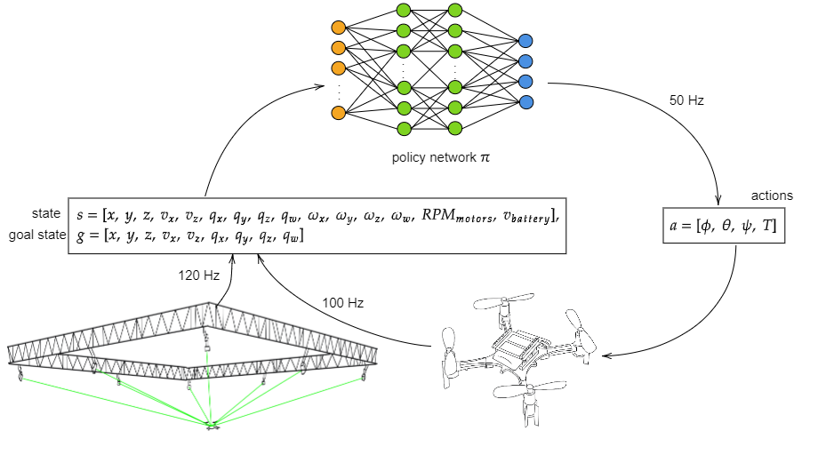

# drone-RL-internship
This repository contains the code produced during a summer internship in 2023 at the [Intelligent Robotics group](https://irobotics.aalto.fi/) in Aalto University. A [Crazyflie 2.1](https://www.bitcraze.io/products/crazyflie-2-1/) drone was trained using a reinforcement learning algorithm (specifically Soft Actor-Critic) to hover in place.

This repository contains code for training the SAC agent, for controlling the drone and for connecting to the OptiTrack infrared camera system used to track the drone. 

The OptiTrack connection code is from Matthew Edwards' NatNet client for Python repository, which can be found at: https://github.com/mje-nz/python_natnet

## The project

The goal of the project was to implement a reinforcement learning algorithm on a real-world robot in the lab.

## The drone

The Crazyflie 2.1 is a small quadcopter whose open source development makes it easy to use for various projects. It weighs only 27 grams and has around 7 minutes of flight time. For this project, the so-called thrust upgrade version of the Crazyflie was used, which had more powerful motors and larger propellers than the standard version. Otherwise, the hardware of the drone was not modified.

## The RL algorithm

